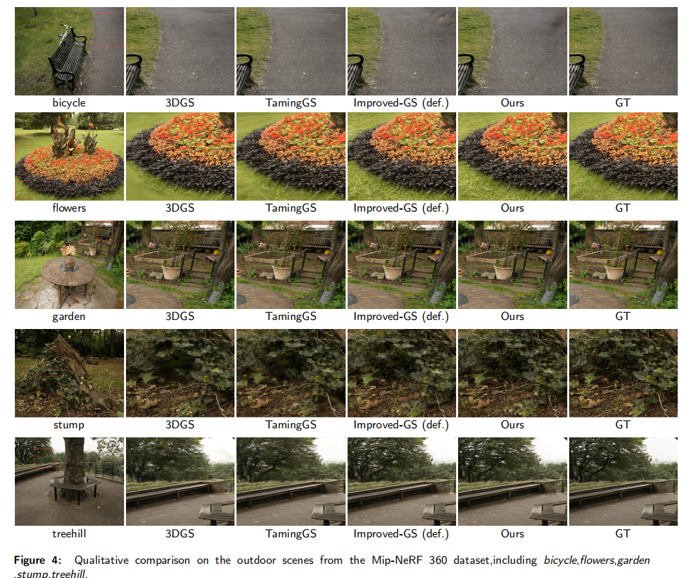
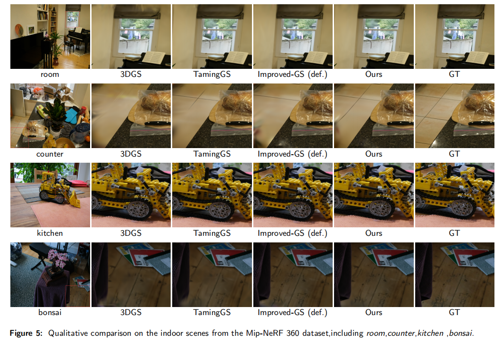
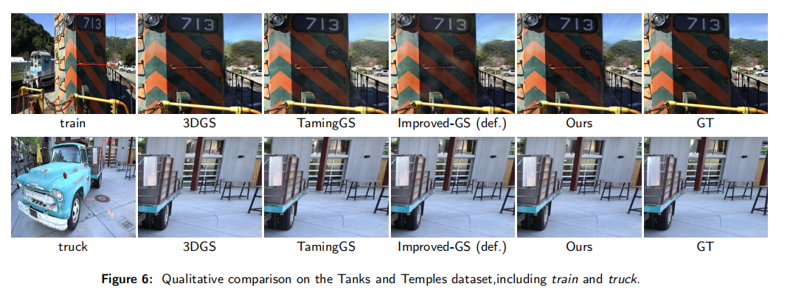
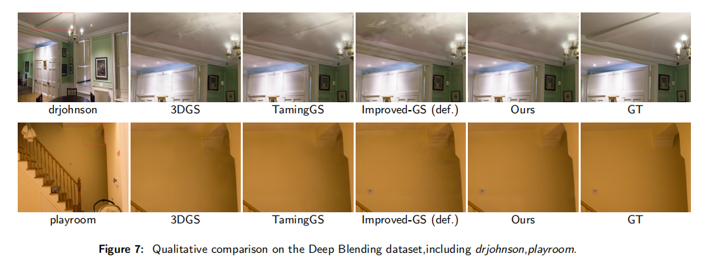
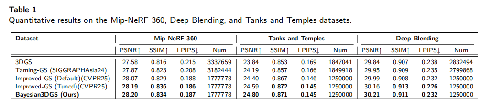
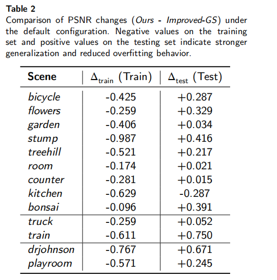

# Bayesian3DGS: Uncertainty-Aware and Adaptive 3D Gaussian Splatting

### Qin Qin,Qing Wang

### Guilin University of Electronic Technology

## [Project Page](https://github.com/sukinishimiyashouko/Bayesian3DGS)
This work introduces Bayesian3DGS, a probabilistic extension that models each Gaussian’s evolution as a Bayesian variable with learnable survival probabilities. Guided by geometry- and color-based priors, rendering likelihoods, and KL-regularized variational inference, the framework enables adaptive and uncertainty-aware optimization. Entropy-driven survival dynamics support balanced densification and pruning, while feature-aware splitting refines geometric and photometric coherence. Extensive experiments demonstrate that Bayesian3DGS achieves reconstruction quality comparable to or surpassing state-of-the-art methods, effectively mitigating overfitting and improving robustness.The proposed formulation provides a theoretically grounded and extensible paradigm for probabilistic Gaussian optimization in 3D scene representation.

## Qualitative Result









## Quantitative Result



## Overfitting Result

## Environment

Before installing our project, you need to ensure that your local environment for compiling the 3DGS CUDA kernel is properly set up, such as having CUDA Toolkit and Visual Studio installed. We recommend that you first install and run the [original 3DGS repository](https://github.com/graphdeco-inria/gaussian-splatting), and then proceed to install our project upon successful setup.

## Installation

Clone the repository

```
git clone https://github.com/sukinishimiyashouko/Bayesian3DGS.git
```

Extract the compressed package of submodules.

Then, you can install the dependencies listed in `environment.yml` following the installation instructions of 3DGS. 

If you are already familiar with installing various 3DGS-based improvements, you may choose to manually install the required libraries. However, please note the following:  

- Ensure that your `pip` version is not too high, otherwise the CUDA kernels in the submodules may fail to install properly.  
- The `numpy` version should be 1.x.x. Sometimes, the default installation may result in `numpy` ≥ 2.0, which you will need to manually downgrade.

## Running

The `budget.txt` file provides the budget parameters we used across various scenes. The "small" version uses 40% of the normal budget, allowing our method to be successfully reproduced even on consumer-grade GPUs such as the RTX 3060. Notably, the performance of the small version still surpasses that of the original 3DGS.


To use this script, you need to create a `data` folder and organize the required 13 scenes in the following structure:

```
data
├── bicycle
│   ├── images
│   └── sparse
├── flowers
├── ...
```

You can also run the code in the same way as 3DGS.

## Parameters

`SparseAdam` : `SparseAdam` is equivalent to enabling, from the beginning, a multi-resolution update (MU) strategy applied only to the SH coefficients at an interval of 16. While this can significantly improve training speed, it also has a notable negative impact on rendering quality. Therefore, we keep `SparseAdam` disabled by default.

 `data_device` : Replacing  `data_device` with "cpu" can save GPU memory, especially in cases with a large number of viewpoints. Users with less than 12GB of GPU memory are recommended to use this option.

## Citation


## Acknowledgments

This project is built upon the open-source code of [TamingGS](https://github.com/humansensinglab/taming-3dgs) and [Improved-GS](https://github.com/XiaoBin2001/Improved-GS). We sincerely thank the authors for their excellent work.
